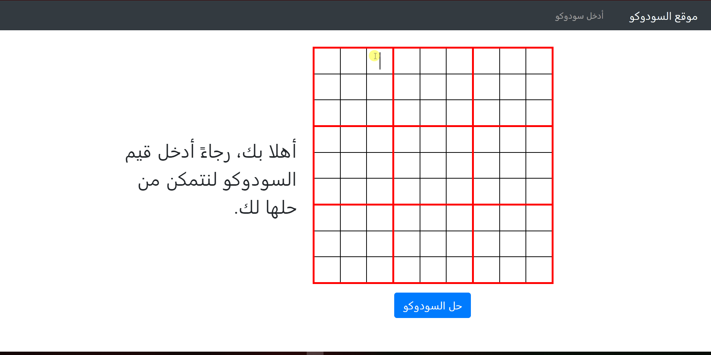

# The Sudoku Website

.موقع بسيط لحل ألغاز السودوكو

Simple sudoku solver website with Arabic interface.

## Demo
You can try the sudoku solver  ***[HERE](https://arabic-sudoku-website.herokuapp.com)***.



This sudoku puzzle is taken from  [7Sudoku](http://www.7sudoku.com/view-puzzle?date=20200119).

## Technologies and Frameworks
***Backtracking*** algorithm is used to solve given sudokus.
 ### Languages 
 - Python (3.8)
 - HTML 
 - CSS
 - Jinja2 (2.10.3)
 
 ### Frameworks
 - Flask (1.1.1)
 - Bootstrap (4.3.1)

## Requirements 
- Python (>= 3.6 Recommended) 
- Flask 

## Environment Setup
If you have Flask already installed with Python >= 3.6 then you are ready to go.

Else you can you can follow these steps to install Flask if you already have Anaconda installed:
1. Open *Anaconda Prompt*.
2. Create a new environment (environment to use flask): ``` conda create --name envName python=3.6 ```
3. Activate the new environment: ` conda activate envName `
4. Install Flask: ``` conda install flask ```  

You can use virtualenv to create a new isolated Python environment and then install the requirements if you don't have Anaconda installed.
 
 ## Installation
 Just download the repository, nothing special is needed.
 
## Usage
#### Using IDE
1. Open the repository folder as a project in your IDE.
2. Configure the project's Python interpreter to use the environment that has Flask installed, or use the one you already created in the "Environment Setup" section.
3. Run ***app.py*** from within the IDE.
 
 *Use a modern IDE like PyCharm or VS Code.*
#### Using Anaconda
1. Open *Anaconda Prompt* in the project folder.
2. Activate your flask environment (or the one you just created in the "Environment Setup" section): ``` conda activate envName ```
3. Type: ``` flask run ```
 
 ## Known Issue
 :bug: Can't identify ***some*** sudokus that don't have a solution. 
